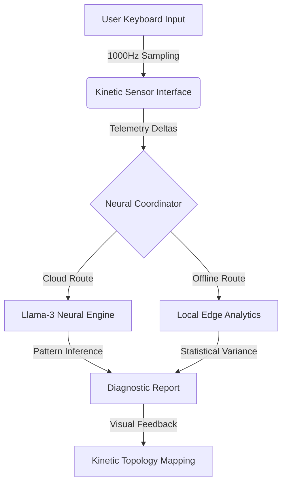

# KINETIC-SCAN: Neurological Telemetry Interface
> **Diagnostic Motor-Kinetic Sensory System for Cognitive Fatigue Detection**

[🚀 **Access Live Interface**](https://ais-pre-hcato2echpbpyohmo5hmgu-344601355778.asia-southeast1.run.app)

---

## 🔬 Executive Summary
**KINETIC-SCAN** is a high-precision neurological assessment tool that detects sub-clinical cognitive fatigue through keyboard interaction telemetry. By tracking motor-kinetic events at a resolution of 1ms, the system builds a unique "Kinetic Topology" for every user, identifying synaptic latency and motor-program degradation that precedes visible performance decline.

---

## 🏗️ System Architecture
The application is built on a **Hybrid-Edge Sensor Architecture**, ensuring that diagnostic capabilities remain functional regardless of cloud availability.

### 1. Kinetic Sensor Interface (Front-End)
*   **Precision Tracking:** Captures `Dwell Time` (key depression duration) and `Flight Time` (latency between keys) with micro-precision.
*   **Visual Ergonomics:** Utilizes a high-contrast, low-latency UI to prevent secondary cognitive load during testing.

### 2. Neural Coordinator (Back-End)
*   **Data Normalization:** Translates raw millisecond data into standardized neuro-ergonomic metrics.
*   **Hybrid Logic:** Dynamically switches between Cloud AI and Local Statistics based on API health.

### 3. Analysis Engines
*   **Neural Engine:** Leverages Meta's Llama-3 (via Groq Cloud) to analyze rhythmic periodicity and motor-program decomposition.
*   **Edge Engine:** Implements a mathematical fallback that measures Coefficient of Variation (CoV) shifts against a homeostatic baseline.

---

## 🧠 Diagnostic Indicators
| Metric | Clinical Basis | Significance |
| :--- | :--- | :--- |
| **Synaptic Jitter** | Rhythmic Periodicity | Primary indicator of acute cognitive fatigue. |
| **Dwell Delta** | Neuromuscular Efficiency | Flags motor-cortex slowing or physical strain. |
| **Flight Latency** | Executive Processing | Measures decision-making deceleration. |
| **Inhibitory Failure** | Error Correction Rate | Detects loss of fine-motor control. |

---

## 🎧 Bio-Acoustic Calibration
The interface integrates a **432Hz Bio-Pulse** harmonic resonator. This sensory focus-anchor is used to stabilize the user's autonomic nervous system prior to assessment, ensuring the highest possible accuracy for the homeostatic baseline.

---

**Development Team:** Asma & Team  
**Sector:** Neuro-Ergonomics / Cognitive Health  
**Release:** v2.5.0-Stable
