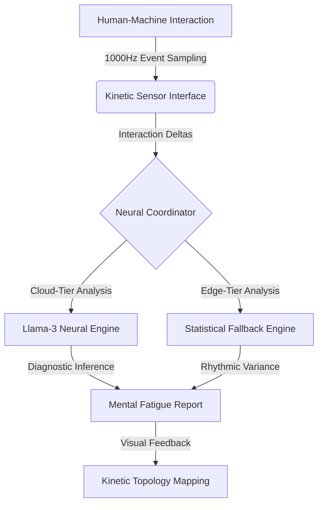

# KINETIC-SCAN: AI-Powered Mental Fatigue Telemetry
> **High-Precision Motor-Kinetic Telemetry for Cognitive Performance Assessment**

[🚀 **Launch Diagnostic Interface**](https://ais-pre-hcato2echpbpyohmo5hmgu-344601355778.asia-southeast1.run.app)

---

## 🔬 Project Overview
**KINETIC-SCAN** is a specialized neurological assessment interface designed to detect sub-clinical mental fatigue. Unlike traditional speed tests, Kinetic-Scan captures high-resolution "Kinetic Topology"—the millisecond-level interaction patterns between the motor cortex and neuromuscular execution. By identifying subtle shifts in typing rhythm, the system surfaces cognitive exhaustion before performance visibly degrades.

---

## 🏗️ System Architecture: The Neural Pipeline
The application utilizes a sophisticated sensory-to-inference pipeline to process raw interaction events into actionable diagnostic data.

### 1. Kinetic Sensor Interface (Front-End)
Built with **React 18** and **Framer Motion**, the interface acts as a micro-precision kinetic sensor capturing:
*   **Dwell Latency:** The duration of synaptic execution (key strike duration).
*   **Flight Latency:** The cognitive synthesis gap (the "think time" between motor sequences).

### 2. Neural Coordinator (Back-End)
A **Node.js/Express** coordinator normalizes raw telemetry into standardized neurological metrics. It compares current interaction states against a homeostatic **Baseline Reference** to calculate the fatigue delta.

### 3. Analysis Engines (Hybrid Intelligence)
*   **Neural Engine:** Leverages Large Language Models to identify complex non-linear patterns in rhythmic decomposition.
*   **Edge Engine:** Provides instant feedback using local statistical analytics (Coefficient of Variance) to ensure diagnostic continuity.

### 4. Progress Management (History)
*   **Persistence:** Locally cached session history allows for longitudinal tracking of mental fatigue across multiple assessments.

---

## 📊 Core Measurement Science
The system evaluates four primary indicators of cognitive state:

| Metric | Scientific Basis | Indicator |
| :--- | :--- | :--- |
| **Dwell Latency** | Neuromuscular Efficiency | Slower strikes indicate physical/motor-cortex exhaustion. |
| **Flight Latency** | Executive Processing | Increased gaps reveal cognitive bottlenecks or "processing lag". |
| **Coeff. of Variance** | Rhythmic Periodicity | High variance (jitter) denotes a breakdown in motor rhythm. |
| **Inhibitory Control** | Corrective Accuracy | Error rates reflect the brain's ability to prune motor mistakes. |

---

## 🎧 Bio-Acoustic Calibration
To minimize environmental noise, the system includes a **432Hz Bio-Pulse** focus anchor. This specific frequency is utilized to stabilize the user's autonomic nervous system prior to the baseline assessment, ensuring maximum diagnostic accuracy.

---

**Developed by:** Asma & Team  
**Sector:** Neuro-Ergonomics / Educational AI Research  
**Version:** 2.6.0-Stable (Professional Release)
