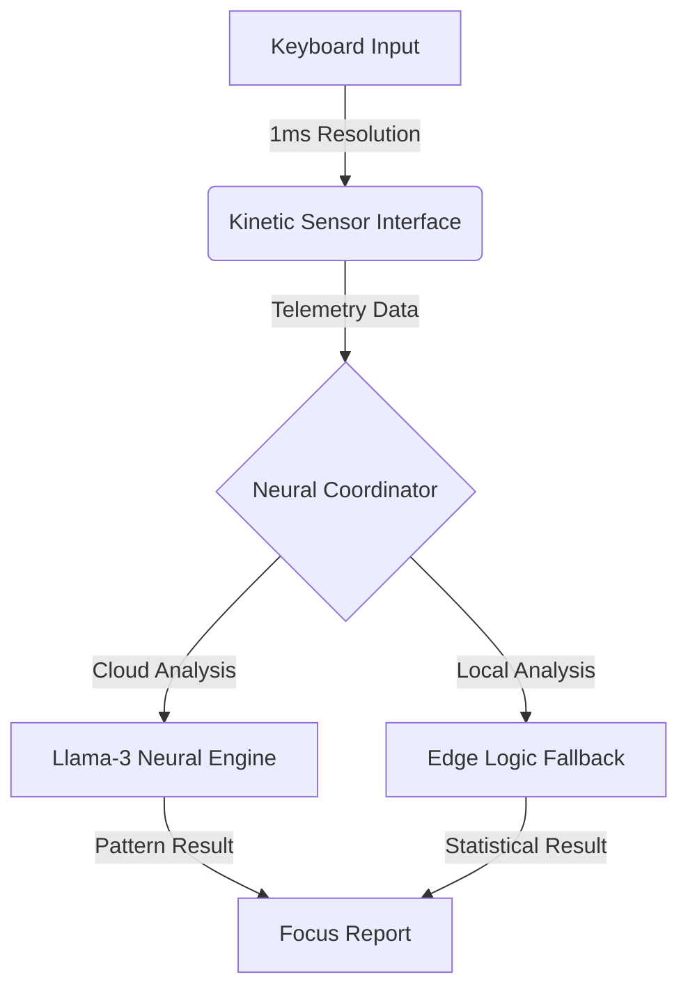

# KINETIC-SCAN: AI-Powered Focus Tracker
> **High-Precision Motor-Kinetic Telemetry for Cognitive Performance**

[🚀 **Launch Interactive Interface**](https://ais-pre-hcato2echpbpyohmo5hmgu-344601355778.asia-southeast1.run.app)

---

## 🔬 What is Kinetic-Scan?
**Kinetic-Scan** is a sensor-based application that detects how "tired" your brain is by tracking your typing rhythm. While a normal speed test only measures words per minute, Kinetic-Scan looks at the tiny millisecond-level patterns (the "Kinetic Topology") of your fingers to see if your focus is slipping.

## 🏗️ System Architecture: The Neural Pipeline
The app operates using a three-stage **Data Pipeline** that moves from your fingers to the cloud.

### 1. The Kinetic Sensor (Front-End)
The React-based interface acts as a high-speed sensor. Every time a key is touched, the app records:
*   **Dwell Time:** How long your finger stays on the key.
*   **Flight Time:** The "think gap" between two key presses.

### 2. The Neural Coordinator (Back-End)
The Node.js server takes this raw data and organizes it. It compares your "Normal State" (Baseline) to your "Current State" to find the **Fatigue Delta** (the difference).

### 3. The Analysis Engine (AI)
We use a **Hybrid System**:
*   **AI Tier:** We send your patterns to **Llama-3** (a large neural network) to look for rhythmic drift.
*   **Edge Tier:** If the AI is busy, a local math engine takes over to analyze your rhythm instantly.

---

## 📊 Core Performance Metrics
We focus on three main markers that tell us about your brain's performance:
*   **Cognitive Speed (Flight Time):** How fast your brain processes the next letter.
*   **Motor Precision (Dwell Time):** How precisely your muscles execute the press.
*   **Rhythmic Stability (Jitter):** How steady your typing "beat" is. A shaky beat usually means high fatigue.

---

## 🎧 Bio-Acoustic Calibration
To ensure a fair test, we use a **432Hz "Focus Tone"**. This specific frequency is designed to help you relax and center your focus before you begin the scan, providing a more accurate baseline.

---

**Developed by:** Asma & Team  
**Category:** Neuro-Ergonomics / Educational AI  
**Version:** 2.6 (Hybrid Pro-Lite)
