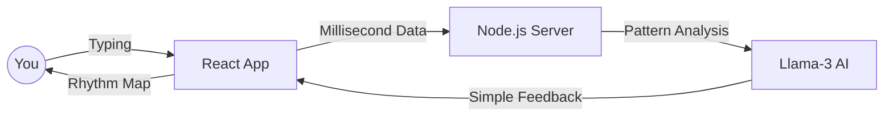

# KINETIC-SCAN: Smart Rhythm Tracker
> **A Fun, AI-Powered way to see how your brain and fingers work together!**

[🚀 **Try the Live App**](https://ais-pre-hcato2echpbpyohmo5hmgu-344601355778.asia-southeast1.run.app)

---

## 👋 What is Kinetic-Scan?
Have you ever noticed that you type differently when you are tired versus when you are excited? **Kinetic-Scan** is a "Smart Sensor" app that tracks your typing rhythm to tell you how focused you are. 

It's like a fitness tracker, but for your brain and fingers!

---

## 🏗️ How it Works (Simple Architecture)

We built this using a **Three-Step Logic**:

1.  **The Input (The Fingers):** As you type, the app measures the tiny gaps between your keys (in milliseconds!).
2.  **The Server (The Math):** Our server calculates your average speed and rhythm.
3.  **The AI (The Genius):** We send your data to an AI "Brain" (Llama-3) that reads your rhythm and tells you if you're in the "Flow Zone" or if you're getting tired.

### 📊 System Diagram

---

## 🧠 What we measure
*   **Key Press Speed:** How fast you press and release a single key.
*   **Thinking Gaps:** The time you spend moving from one letter to the next.
*   **Rhythm Score:** How consistent your typing "beat" is.

---

## 🎵 The Focus Sound
We included a **432Hz Focus Tone**. Scientists and musicians often use this frequency because it helps people stay calm and focused. Before you start the test, listen to the tone for 10 seconds to "reset" your brain!

---

**Created by:** Asma & Team  
**Learning Focus:** Web Sensors + AI Logic  
**Version:** 1.0 (Student Edition)
